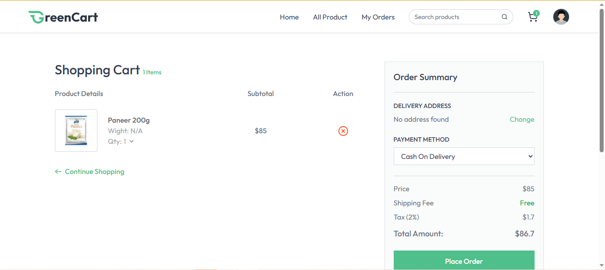
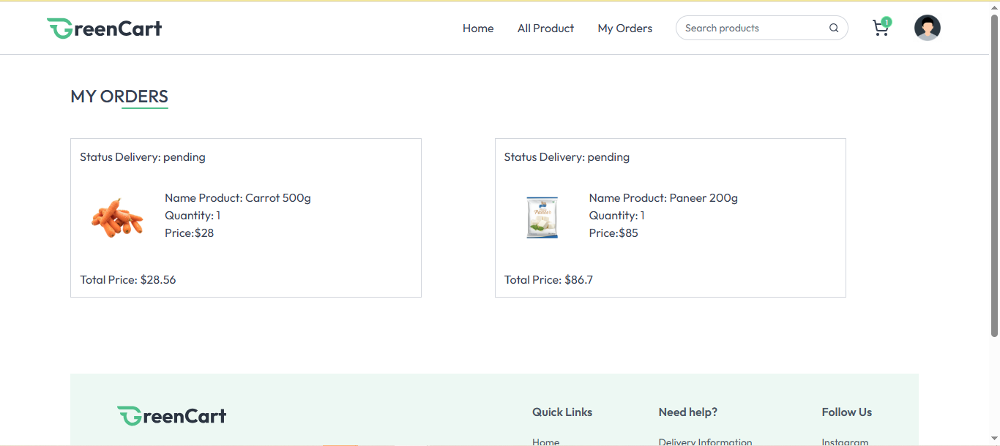
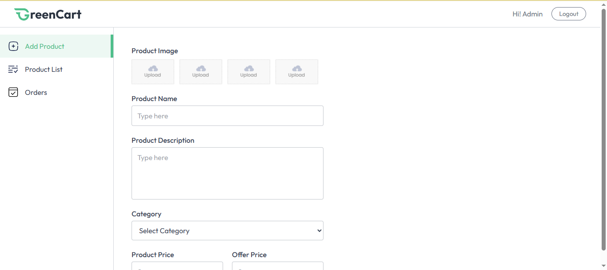

# E-Commerce Website

A full-stack e-commerce application that allows users to browse products, manage carts, place orders, and make payments.

## Features
- User Authentication
- Product Catalog
- Shopping Cart
- Order Management
- Stripe Payment Integration
- Admin Product Management

### Frontend
- React
- Vite
- Axios
- Tailwind CSS

### Backend
- Node.js
- Express.js
- PostgreSQL
- JWT Authentication
- Stripe API

## Screenshots

### Home Page

### Product Detail

### Cart

### Order History

### Admin Dashboard

## Architecture

Frontend (React) ->
Backend API (Express.js) ->
PostgreSQL

## Backend Repository

[(link backend github)](https://github.com/shierleywakpoh/BE_ECommerce_V2)
